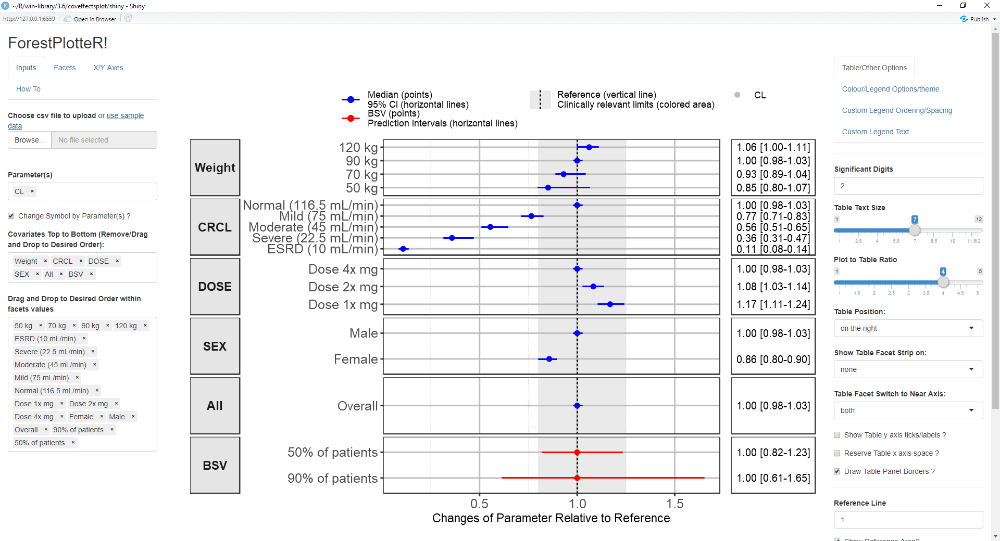
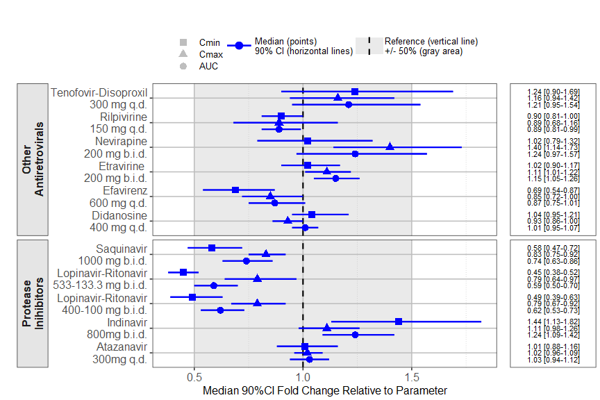

# coveffectsplot 

<!-- badges: start -->
[](https://cran.r-project.org/package=coveffectsplot)
[](https://github.com/smouksassi/coveffectsplot/actions)
[](https://CRAN.R-project.org/package=coveffectsplot)
[](https://CRAN.R-project.org/package=coveffectsplot)
[](https://github.com/smouksassi/coveffectsplot/actions/workflows/R-CMD-check.yaml)
<!-- badges: end -->

A package that provides the function `forest_plot`and an accompanying Shiny App that facilitates the production of forest plots to visualize covariate effects as commonly used in pharmacometrics population PK/PD reports.

#### Publication:

[Tutorial: Evaluation of Covariate Effects using Forest Plots and Introduction to the `coveffectsplot` R package](https://ascpt.onlinelibrary.wiley.com/doi/abs/10.1002/psp4.12829)

### Installation and Running information
```
# Install from CRAN:
install.packages("coveffectsplot")
# Or the development version from GitHub:
#install.packages("devtools")
devtools::install_github('smouksassi/coveffectsplot')
```
Launch the app using this command then press the use sample data blue text to load the app with a demo data:
```
coveffectsplot::run_interactiveforestplot()
```
This will generate this plot:


### Expected data
Several example data are provided to illustrate the various functionality but the goal is that you simulate, compute and bring your own data. The app will help you, using point and click interactions, to design a plot that communicates your model covariate effects. 
The data that is loaded to the app should have at a minimum the following columns with the exact names:
* paramname: Parameter on which the effects are shown e.g. CL, Cmax, AUC etc.  
* covname: Covariate name that the effects belong to e.g. Weight, SEX, Dose etc.  
* label: Covariate value that the effects of which is shown e.g. 50 kg, 50 kg\90 kg (here the reference value is contained in the label).   
* mid: Middle value for the effects usually the median from the uncertainty distribution.   
* lower: Lower value for the effects usually the 2.5% or 5% from the uncertainty distribution.   
* upper: Upper value for the effects usually the 97.5% or 95% from the uncertainty distribution.   

You might also choose to have a covname with value All (or other appropriate value) to illustrate and show the uncertainty on the reference value in a separate facet.

Additionally, you might  want to have a covname with value BSV to illustrate and show the the between subject variability (BSV) spread.

The example data show where does 90 and 50% of the patients will be based on the model BSV estimate for the selected paramname(s).


The vignette [Introduction to coveffectsplot](https://cran.r-project.org/package=coveffectsplot/vignettes/introduction_to_coveffectsplot.html) will walk you through the background and  how to compute and build the required data that the shiny app or the function `forest_plot`expects. There is some data management steps that the app does automatically. Choosing to call the function will require you to build the table LABEL and to control the ordering of the variables. The `forest_plot` help has several examples.  
The package also include vignettes with several step-by-step detailed examples:  

<a href="https://cran.r-project.org/package=coveffectsplot/vignettes/PK_Example.html">PK example</a>  
<a href="https://cran.r-project.org/package=coveffectsplot/vignettes/Pediatric_Cov_Sim.html">Pediatric example</a>  
<a href="https://cran.r-project.org/package=coveffectsplot/vignettes/PKPD_Example.html">PK PD example</a>      
<a href="https://cran.r-project.org/package=coveffectsplot/vignettes/Exposure_Response_Example.html">Exposure Response</a>  
 
### Example using a real drug label data
The prezista drug label data was extracted from the FDA label and calling the `forest_plot` function gives:

``` r
library(coveffectsplot)
plotdata <- dplyr::mutate(prezista,
          LABEL = paste0(format(round(mid,2), nsmall = 2),
                         " [", format(round(lower,2), nsmall = 2), "-",
                         format(round(upper,2), nsmall = 2), "]"))
plotdata<- as.data.frame(plotdata)
plotdata<- plotdata[,c("paramname","covname","label","mid","lower","upper","LABEL")]
plotdata$covname <- factor(plotdata$covname)
levels(plotdata$covname) <- c ("Other\nAntiretrovirals","Protease\nInihibitors")

#png("prezista.png",width =12 ,height = 8,units = "in",res=72,type="cairo-png")
coveffectsplot::forest_plot(plotdata,
            ref_area = c(0.5, 1.5),
            base_size = 16 ,
            x_facet_text_size = 13,
            y_facet_text_size = 16,
            y_facet_text_angle = 270,
            interval_legend_text = "Median (points)\n90% CI (horizontal lines)",
            ref_legend_text = "Reference (vertical line)\n+/- 50% (gray area)",
            area_legend_text = "Reference (vertical line)\n+/- 50% (gray area)",
            xlabel = "Median 90%CI Fold Change Relative to Parameter",
            facet_formula = "covname~.",
            facet_switch = "both",
            facet_scales = "free",
            facet_space = "free",
            strip_placement = "outside", 
            paramname_shape = TRUE,
            table_position = "right",
            table_text_size = 4,
            plot_table_ratio = 4,
            vertical_dodge_height = 0.8,
            legend_space_x_mult = 0.1,
            legend_order = c("shape","pointinterval","ref", "area"),
            legend_shape_reverse = TRUE,
            show_table_facet_strip = "none",
            return_list = FALSE)
#dev.off()
```




            
